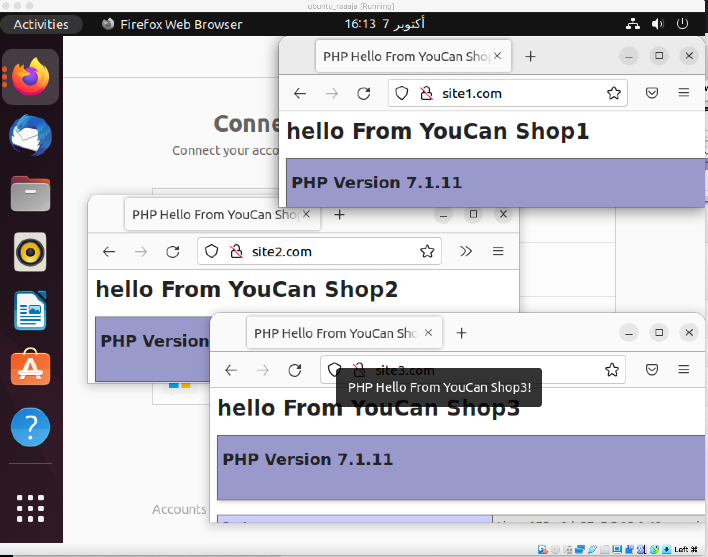

# Save-our-deploy-train

This project is about creating virtual hosts using nginx

## Dependencies

The project depends on:

* Ansible: a suite of software tools that enables infrastructure as code.

* Docker/Docker-compose: tool for defining and running multi-container Docker applications.

## Some external dependencies:

* Nginx: is a web server that can also be used as a reverse proxy, load balancer, mail proxy and HTTP cache. 

* php: Is a general-purpose scripting language geared towards web development.

## Building the project

Here is a schema representing the steps taken in order to build the project:


To demonstrate how to create a virtual host , I set up an environment to host three websites with different domain names on a single physical server.

Virtual hosting is widely used by website hosting companies in order to achieve economies of scale and to cater to multiple clients without spending much on dedicated server resources or hardware.

## Guidelines

To run the project, you will have to follow these steps.


```
sudo sh install-ansible.sh
```

then run the following command

```
sudo ansible-playbook playbook.yml
```
To run this project you don't have to check if the dependencies installed in your server; everything is automated.

The Ansible playbook will check if the dependencies are installed, they will be automatically installed in which case they were not installed. Assuming you will be running this project on a fresh environment to prevent conflicts.


after the playbook is running launch the command 

```
docker ps -a  
```
it will display the following output 
```
CONTAINER ID   IMAGE                   COMMAND                  CREATED          STATUS          PORTS                               NAMES
abf3f74e3fbd   php:7.1.11-fpm-alpine   "docker-php-entrypoi…"   39 seconds ago   Up 37 seconds   9000/tcp                            docker_compose_php_1
4135a7477dd9   nginx:alpine            "/docker-entrypoint.…"   39 seconds ago   Up 37 seconds   0.0.0.0:80->80/tcp, :::80->80/tcp   docker_compose_web_1
```

dont forget to add the following line to /etc/hosts 

```
<YOUR IP ADDRESS> site1.com site2.com site3.com 

```

In the browser check by entering:

```
* http://site1.com
* http://site2.com
* http://site3.com

```
you will get the following output


